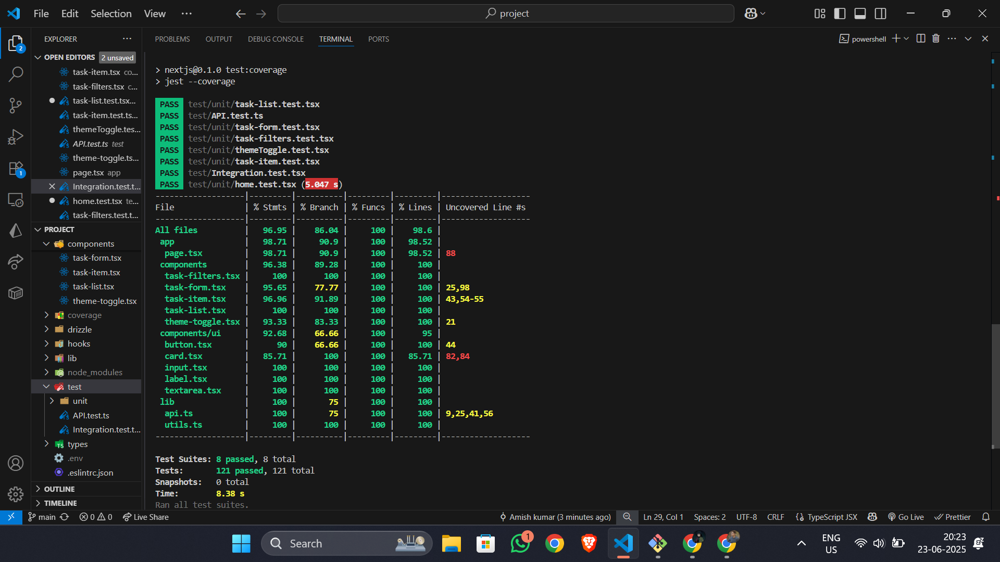
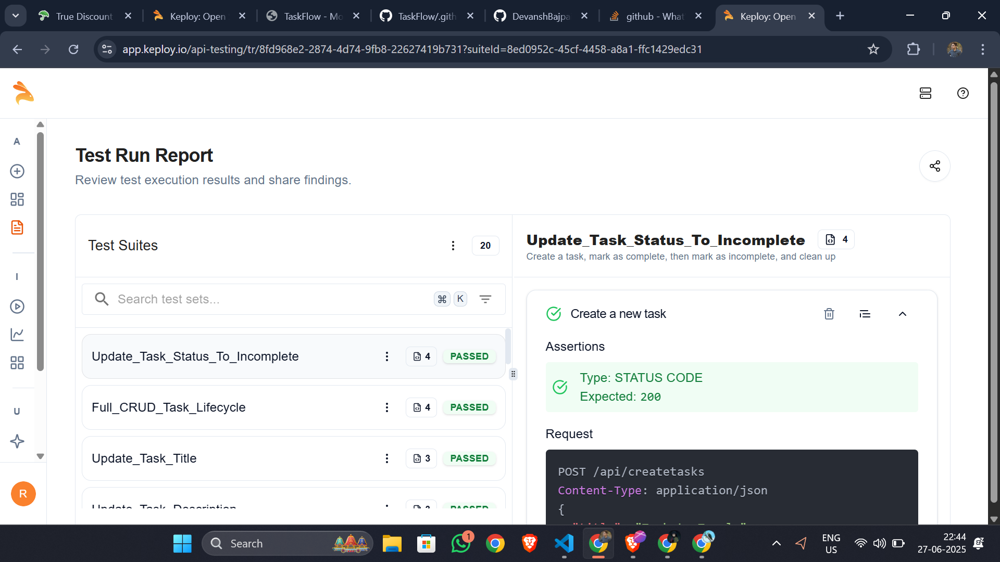

# ✅ **TaskFlow API** — *Custom Task Management API*

A **fully functional API server** for managing tasks, built using **Next.js App Router**, **NeonDB + Drizzle ORM**, and an optional **React frontend** for smooth user interaction.
This API allows users to:

> ✅ **Create**, **Read**, **Update**, and **Delete** tasks seamlessly.

> 🔍 **All endpoints are tested and verified using [Postman](https://www.postman.com/)**

---

## 🔗 **Live Project**

 **[Visit the Live App](https://task-flow-hazel-xi.vercel.app/)**

---

## 🚀 **Tech Stack**

* 🧭 **Framework:** `Next.js 14 (App Router)`
* 🗄️ **Database:** `PostgreSQL` (hosted on [Neon](https://neon.tech/))
* 🧬 **ORM:** `Drizzle ORM`
* 🎨 **Frontend:** `React + Tailwind CSS`
* ☁️ **Deployed:** `Vercel`

---

### 🧾 **OpenAPI Schema**

Explore the complete API structure defined using the OpenAPI 3.0.3 specification.

🔗 **[📝 View OpenAPI Spec](https://github.com/amish-kumar-07/TaskFlow/blob/main/OpenApiSchema.md)**  
*(Click to preview the full schema file in your browser)*

---

## 📊 **Test Coverage**

All core units and API functionalities are thoroughly tested using **Jest** and **React Testing Library**, with automated coverage reports.

> ✅ Test Runner: `Jest`
> ✅ Coverage Command: `npm run test:coverage`

### 🧪 Summary (as of latest run)

| Metric      | Value                    |
| ----------- | ------------------------ |
| Statements  | `96.95%`                 |
| Branches    | `86.04%`                 |
| Functions   | `100%`                   |
| Lines       | `98.6%`                  |
| Test Suites | `8 passed / 8 total`     |
| Total Tests | `121 passed / 121 total` |
| Time        | `8.38 seconds`           |

### 📂 Notable Coverage Highlights



---
---
## ✅ API Test Automation with Keploy

This project integrates [Keploy](https://keploy.io) for API test automation via GitHub Actions.

### 📸 Test Reports Screenshot
<!-- or upload and use raw.githubusercontent link -->

 >GitHub CI/CD Setup
 [Click to view CI/CD config](.github/workflows/ci.yml)
---

## 📦 API Endpoints

> All endpoints use `/api/` as the base route. All responses are in JSON.

### 1. 🟢 Fetch All Tasks

- **URL:** `/api/fetchdata`
- **Method:** `GET`
- **Description:** Retrieves all tasks from the database.

#### ✅ Sample Response

```json
{
    "success": true,
    "data": [
        {
            "id": 2,
            "title": "Amish 2",
            "description": "test 2",
            "completed": true,
            "dueDate": "2025-07-05T00:00:00.000Z",
            "createdAt": "2025-06-21T06:00:44.882Z",
            "updatedAt": "2025-06-21T06:23:34.314Z"
        }
    ]
}
````

---

### 2. 🟡 Create a New Task

* **URL:** `/api/createtasks`
* **Method:** `POST`
* **Description:** Adds a new task to the database.
* **Request Body:**

```json
{
  "title": "Finish assignment",
  "description": "Submit",
  "dueDate": "2025-06-22T00:00:00.000Z"
}
```

#### ✅ Sample Response

```json
{
    "id": 7,
    "title": "Finish assignment",
    "description": "Submit",
    "completed": false,
    "dueDate": "2025-06-22T00:00:00.000Z",
    "createdAt": "2025-06-21T06:43:19.440Z",
    "updatedAt": "2025-06-21T06:43:19.440Z"
}
```

---

### 3. 🛠️ Update a Task (Partial)

* **URL:** `/api/update?id=<taskId>`
* **Method:** `PATCH`
* **Description:** Updates specific fields of a task.
* **Request Body:** (one or more fields)

```json
{
  "completed": true
}
```

#### ✅ Sample Response

```json
{
  "success": true,
  "data": {
      "id": 3,
      "title": "Amish 3",
      "description": "test 3",
      "completed": true,
      "dueDate": "2025-07-30T00:00:00.000Z",
      "createdAt": "2025-06-21T06:10:36.964Z",
      "updatedAt": "2025-06-21T06:48:16.895Z"
    }
}
```

---

### 4. 🔴 Delete a Task

* **URL:** `/api/delete?id=<taskId>`
* **Method:** `DELETE`
* **Description:** Deletes a task by its ID.

#### ✅ Sample Response

```json
{
    "success": true,
    "message": "Task deleted",
    "data": {
        "id": 3,
        "title": "Amish 3",
        "description": "test 3",
        "completed": true,
        "dueDate": "2025-07-30T00:00:00.000Z",
        "createdAt": "2025-06-21T06:10:36.964Z",
        "updatedAt": "2025-06-21T06:48:16.895Z"
    }
}
```

---

## 🧑‍💻 How to Run Locally

1. **Clone the repository**

   ```bash
   git clone https://github.com/amish-kumar-07/TaskFlow
   ```

2. **Install dependencies**

   ```bash
   npm install
   ```

3. **Set up your `.env.local`**

   ```env
   DATABASE_URL="your-neon-postgres-url"
   ```

4. **Run your app**

   ```bash
   npm run dev
   ```

---

## 📌 To-Do Table Schema

```ts
pgTable("tasks", {
  id: integer("id").primaryKey().generatedAlwaysAsIdentity(),
  title: varchar("title", { length: 255 }).notNull(),
  description: varchar("description", { length: 1000 }).notNull(),
  completed: boolean("completed").default(false).notNull(),
  dueDate: timestamp("due_date"),
  createdAt: timestamp("created_at").defaultNow().notNull(),
  updatedAt: timestamp("updated_at").defaultNow().notNull(),
});
```

---

## 📬 Feedback

Got questions or suggestions? Feel free to reach out via Issues or Email !
Email - rashusingh110@gmail.com
---
